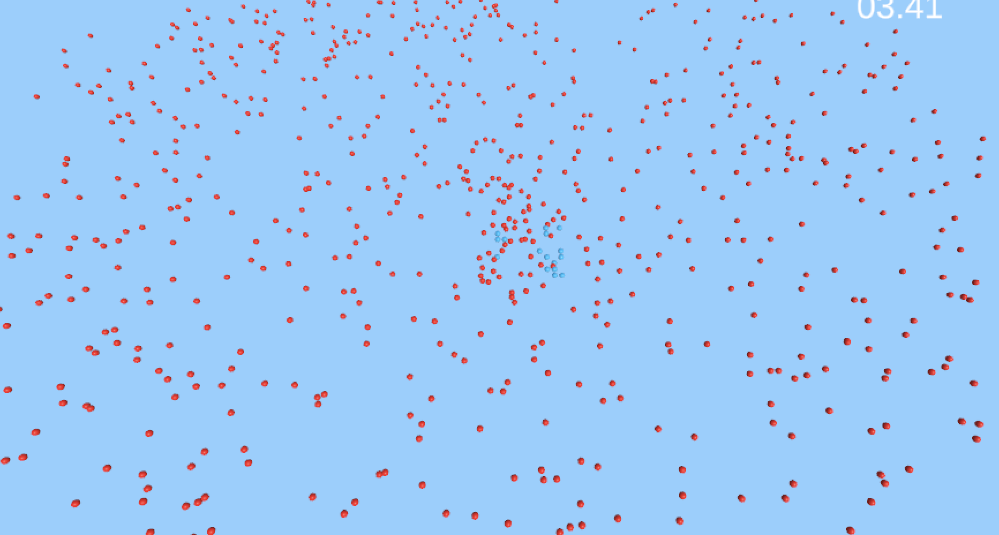

# Unity-Entities-Dodge-the-Bullets

## 한국어 (Korean)
이 저장소는 ECS를 사용해서 닷지(총알 피하기) 게임을 구현한 예제 입니다.
붉은 총알을 피해 최대한 오래 살아남으세요!

이 예제에서는 다음 과정을 배웁니다.

* 게임 오브젝트를 엔티티로 베이크 하는 방법
* 엔티티 커맨드 버퍼를 사용하는 방법
* 총알 튕김을 구현하는 방법
* MonoBehaviour와 엔티티 시스템 사이에 정보를 교환하는 방법
* IJobEntity를 통해 잡으로 엔티티를 제어하는 방법

## English (영어)
This repository is an example of implementing bullet dodging game using ECS.
Dodge the bullet for as long as possible!

In this example, you will learn the following steps

* How to bake a GameObject into an Entity.
* How to use the Entity Command Buffer
* How to implement bullet bounce.
* How to exchange information between MonoBehaviour and the entity system.
* How to control entities with jobs via IJobEntity